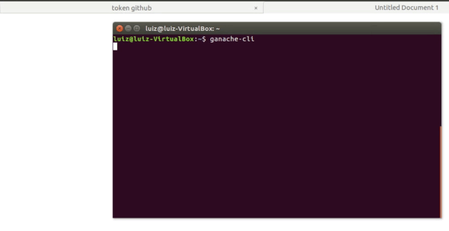

## UNICEF Innovation Challenge - Blockchain

# Dependencies
Do you have **nodejs** installed? 

https://nodejs.org/en/download/

You also need **Truffle** - It is a developer tool to work with Ethereum

`npm install -g truffle`

Install **Metamask** - It is a browser plugin Chrome to work with Ethereum wallets. If you have never used Metamask,
you may watch this video first: [How to use Metamask](https://media.consensys.net/how-to-use-metamask-like-a-wizard-850a96fdd95c)

https://metamask.io/

Install **ganache-cli** - Ganache  simulates Ethereum blockchain for tests purposes

`npm install -g ganache-cli`

After environment is setup, clone this repo:
`git clone https://github.com/fosgate29/Signature-Example.git`

Then, open a new terminal and execute `ganache-cli`

After **Ganache** is running, go to **market** folder and execute **npm install** and wait because it may take some time

`npm install`

When it is done, execute `truffle migrate --development --reset` (it will compile and send the compiled smart contract to Ganache instance)

Open your browser that you have **Metamask** working and unlock it. Please get seeds words from Ganache to be able to important the tests accounts to Metamask.

Execute

`npm run dev` 

and open this url: localhost:8080

Metamask will open and warn that a Dapp is trying to access your accounts. Please click ok.

# How this demo works

When it opens, you will see a form.

- First step is done by the seller. Now it is done manually, but the final product would do this hash in the backend. So, eEach product that is going to be sold in a stock, will have tag. It can be a QR code or barcode. For this demo, add any number and click **Hash Tag Id**.

- After it is hashed, seller needs to sign it. So, when the product is sold to a buyer, we can guarantee the value that is being paid for that product is sent to the seller. You have to manually copy it and paste it to the input space and click **Sign Data**. Metamask will open a window and ask to sign the data. Accept it and you will see the signature in the screen.

- Now, with the signed hash, copy it and paste in the last form. Now this demo will simulate a buyer action. Add to the form the same tag id that was added in the first form, the price that you are paying for it, you can add **10000000000000000000** (1 Ether), the **seller** address. Seller address is the address of who signed the tag id hash. And at last but not the least, add the signature that were create in the previous step. 

- With all input fields filled, click **Buy Product**. Metamask will open for you to confirm the transaction. For the first time, you don´t have to change the Metamask user. It can be the same address for the seller, buyer and stockist. Why do we need stockist address? I added to the logic a fee for the stockist. It is fixed now in 10%, but Smart Contract can be easily updated to make this value dynamic. 

# Video

- [Slide presentation](https://youtube.com): 4 minutes video explaining the solution
